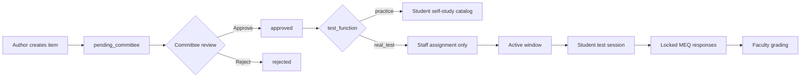

# Term of Reference (ToR)
## Medical Examination Platform (MEQ Platform)

**Document version:** 1.0  
**Date:** 19 May 2026  
**Project name:** meq-platform (Medical Examination Platform)  
**Status:** Draft for research / paper routine

---

## 1. Executive summary

The Medical Examination Platform is a web-based assessment system for undergraduate medical education. It supports two principal item formats—**Modified Essay Questions (MEQ)** and **Single Best Answer (SBA)**—within a governed workflow: faculty and sub-administrators author content; subject committees review and approve items; administrators manage users and policy; students complete practice or formally assigned examinations.

The platform is implemented as a **Next.js** single-page application backed by **Supabase** (PostgreSQL, authentication, row-level security). This document defines the purpose, scope, stakeholders, requirements, and success criteria to guide research, evaluation, and further development.

---

## 2. Background and problem statement

### 2.1 Context

Medical schools routinely assess clinical reasoning through staged case-based MEQs and knowledge through SBA (multiple-choice) items. Traditional paper-based or ad hoc digital workflows make it difficult to:

- Maintain a central, versioned item bank aligned to curriculum codes and clinical subjects
- Enforce committee review before items enter summative use
- Separate **formative practice** from **summative (real) tests** with controlled delivery windows
- Record typed MEQ responses, human grading, and audit trails for quality assurance
- Apply standard-setting methods (e.g. Modified Angoff) at item level before approval

### 2.2 Problem

Without an integrated platform, item authoring, committee approval, test assembly, student delivery, and grading remain fragmented across spreadsheets, email, and local files—reducing reproducibility, security, and alignment with accreditation expectations.

### 2.3 Proposed solution

A role-based web application that unifies the assessment lifecycle from item creation through committee review, assignment to cohorts, timed test sessions, and staff grading—with database-enforced access control.

---

## 3. Purpose and objectives

### 3.1 Primary purpose

To provide a secure, curriculum-aligned environment for creating, reviewing, delivering, and grading MEQ and SBA assessments in a medical school setting.

### 3.2 Specific objectives

| # | Objective | Measurable indicator |
|---|-----------|----------------------|
| O1 | Centralize MEQ and SBA item banks by subject and course code | Items queryable by subject, year, review status |
| O2 | Enforce committee governance before summative use | No `real_test` visible to students until `approved` and assigned |
| O3 | Support staged MEQ delivery with draft/locked responses | Per-stage `meq_stage_responses` with status lifecycle |
| O4 | Enable staff to bundle tests and assign to students/groups with time windows | `staff_test_assignments` with `window_start` / `window_end` |
| O5 | Support human MEQ grading with audit history | Append-only `grading_history`; optional human override scores |
| O6 | Support item-level standard setting (Modified Angoff) | `committee_angoff_ratings` per MEQ stage or SBA question |
| O7 | Separate practice (self-study) from summative delivery | `test_function`: `practice` vs `real_test` + RLS rules |

---

## 4. Scope

### 4.1 In scope (current system)

- User registration/login (Supabase Auth) with role-based profiles
- Roles: **student**, **educator**, **sub_admin**, **admin**
- MEQ test authoring: vignette, multi-stage questions, per-stage timers, media, task categories
- SBA test authoring: stems, options, images, correct key
- Committee structure: departments, committees, members, subject/year/course scope
- Test review workflow: `pending_committee` → `approved` / `rejected`
- Practice test catalog for students (approved practice items)
- Formal test assignments (bundles + recipients + scheduling)
- Student test-taking UI (MEQ exam flow, SBA exam flow)
- Staff grading dashboard for locked MEQ responses
- Sub-admin: committee review, Angoff ratings, committee scoring
- Admin: user management, audit views, password reset API
- Course catalog integration (`course_catalog`)
- CSV import helpers for bulk MEQ stages / SBA questions

### 4.2 Out of scope (explicit exclusions or future work)

- Fully automated AI grading in production (UI references “soon”; `meq_ai_training_records` exists for future training data)
- Native mobile applications (responsive web only)
- Proctoring / lockdown browser integration
- Integration with external LMS (Canvas, Moodle) — not present in codebase
- Multi-institution tenancy (single-institution model assumed)

### 4.3 Boundaries

- **Frontend:** Next.js 16 (App Router), React 19, Tailwind CSS 4
- **Backend:** Supabase PostgreSQL + RLS policies; minimal Next.js API routes (e.g. admin password reset)
- **Deployment:** Document assumes Vercel-compatible hosting; database on Supabase

---

## 5. Stakeholders and user roles

| Stakeholder | Role in system | Primary activities |
|-------------|----------------|-------------------|
| Medical student | `student` | Browse subjects; take practice tests; complete assigned real tests; view grades |
| Faculty / item writer | `educator` | Create MEQ/SBA items; manage own tests; grade submissions; create assignments |
| Committee member / lead | `sub_admin` | Review pending tests; Angoff ratings; committee scoring; scoped edit by subject/year |
| System administrator | `admin` | User approval; departments; full visibility; audit; policy |
| Institution (implicit) | — | Curriculum alignment, accreditation, data governance |

**Educator onboarding:** Users requesting educator role enter `approval_status: pending` until admin approves (`/pending-approval`).

---

## 6. Functional requirements

### 6.1 Authentication and profiles

- FR-A1: Users authenticate via Supabase Auth (email/password; forgot/reset password flows).
- FR-A2: On signup, a `profiles` row is created with role, student year, staff/student IDs, institution.
- FR-A3: Post-login routing by role: students → `/subjects`; educators/admin → `/dashboard`; sub_admin → `/sub-admin`.

### 6.2 Item authoring

- FR-C1: Educators/sub-admins create **MEQ tests** with vignette, first-page stem, optional test-level timer, linked department/committee.
- FR-C2: Each MEQ test has ordered **stages** (`meq_test_stages`) with question text, stage information, media URLs, optional per-stage timer.
- FR-C3: MEQ stages may be classified by **task category** (e.g. problem identification, clinical reasoning—10 categories per `meqTaskCategories.ts`).
- FR-C4: Educators create **SBA tests** with multiple questions; each question has stem, JSON options, correct option ID, optional image.
- FR-C5: Items default to `review_status: pending_committee` until committee action.
- FR-C6: `test_function` distinguishes **practice** vs **real_test**; `assessment_purpose` distinguishes formative vs summative (per migrations).

### 6.3 Committee and approval

- FR-R1: Sub-admins and admins manage committees (subject, test year, course code, purpose).
- FR-R2: Committee members review tests at `/sub-admin/test-review/[kind]/[testId]`.
- FR-R3: Approved tests enter student-visible pools per RLS; rejected tests do not.
- FR-R4: **Modified Angoff**: reviewers record P(correct) per MEQ stage or SBA question (`committee_angoff_ratings`, rounds 1–2).

### 6.4 Delivery and test-taking

- FR-D1: Students see approved **practice** tests via subject catalog (`/subjects`, `/practice-tests`).
- FR-D2: **Real tests** are visible only when included in a `staff_test_assignment` whose window is active and student is a recipient (direct or via student group).
- FR-D3: MEQ responses saved as draft until locked; students cannot edit locked responses.
- FR-D4: SBA responses store selected option and computed correctness.
- FR-D5: Test-taking routes: `/exam/[id]` (MEQ), `/exam/sba/[id]` (SBA), `/test-taking` (assignment session).

### 6.5 Assignments and grouping

- FR-T1: Staff create **test groups** (bundles of MEQ and/or SBA tests).
- FR-T2: Staff create **student groups** and assign members.
- FR-T3: Assignments link a test group to recipients with optional `window_start` / `window_end`.

### 6.6 Grading and feedback

- FR-G1: Educators, sub-admins, and admins access MEQ grading dashboard (`/dashboard/grade`).
- FR-G2: Graders view locked responses, rubric text (when present), append scores/feedback to `grading_history`.
- FR-G3: `human_override_score` and `ai_rationale_feedback` fields support manual scoring and future AI assistance.
- FR-G4: Students view outcomes via `/my-grades`.

### 6.7 Administration

- FR-AD1: Admin dashboard for user management and system configuration.
- FR-AD2: Audit logging (admin audit page).
- FR-AD3: API route for admin-initiated password reset.

---

## 7. Non-functional requirements

| Category | Requirement |
|----------|-------------|
| **Security** | Row-level security on all sensitive tables; students access only approved/assigned content; staff scoped by role and committee membership |
| **Privacy** | Student responses visible to self; staff see responses only within grading/review roles; FERPA/HIPAA-style handling per institutional policy (configure operationally) |
| **Availability** | Target uptime per institutional SLA (not coded—operational) |
| **Performance** | Acceptable page load for exam delivery under typical cohort sizes (validate empirically in research) |
| **Usability** | Responsive layout; mobile viewport meta for student menus |
| **Maintainability** | Schema migrations in `supabase/migrations/`; consolidated `schema.sql` as reference |
| **Auditability** | `grading_history` append-only JSON; content logs (SBA bundles migration); committee review status |

---

## 8. System architecture (summary)

```
┌─────────────────────────────────────────────────────────────┐
│                    Client (Browser)                          │
│              Next.js App Router + React                      │
└─────────────────────────┬───────────────────────────────────┘
                          │ HTTPS
┌─────────────────────────▼───────────────────────────────────┐
│  Supabase                                                    │
│  ├── Auth (JWT)                                              │
│  ├── PostgreSQL                                              │
│  │     ├── profiles, committees, course_catalog              │
│  │     ├── meq_tests / meq_test_stages / meq_stage_responses │
│  │     ├── sba_tests / sba_test_questions / sba_question_responses │
│  │     ├── staff_test_groups, assignments, recipients        │
│  │     └── committee_angoff_ratings, rubrics, audit tables   │
│  └── RLS policies + security definer functions               │
└─────────────────────────────────────────────────────────────┘
```

**Key data entities:** profiles, departments, committees, meq_tests, meq_test_stages, sba_tests, sba_test_questions, responses, staff_test_groups, staff_test_assignments, committee_angoff_ratings.

**MEQ task categories (clinical reasoning framework):**

1. Problem Identification  
2. Hypothesis Generation  
3. Data Gathering  
4. Data Interpretation  
5. Clinical Reasoning  
6. Patient Management  
7. Patient Education/Counseling  
8. Ethics/Jurisprudences  
9. Evidence-based Medicine/Biostatistics  
10. Basic Knowledge  

**Clinical subjects (examples):** Internal Medicine, Pediatric, OB/GYNE, Surgery, Emergency Medicine, Orthopedic, Otolaryngology, Ophthalmology, Forensic, Anesthesiology, Family Medicine/Community Medicine.

---

## 9. Governance workflow



---

## 10. Assumptions and constraints

### Assumptions

- A single medical school or faculty operates one Supabase project.
- Students have institutional email accounts for authentication.
- Committees exist per subject/course/year with trained sub-administrators.
- Internet access is available during practice; summative sessions follow institutional exam rules.

### Constraints

- Dependency on Supabase availability and configuration (`NEXT_PUBLIC_SUPABASE_URL`, anon key).
- AI grading is not production-ready; research must treat human grading as primary.
- Browser-based delivery only.

---

## 11. Research and evaluation framework (for paper routine)

Use this ToR to structure empirical or descriptive research. Suggested research questions:

1. Does the platform reduce time from item draft to committee-approved status compared to legacy workflow?
2. Do students use practice MEQs/SBAs at rates that correlate with summative performance?
3. Is inter-rater reliability improved when `grading_history` and rubrics are standardized?
4. Do Modified Angoff ratings (committee consensus) predict item difficulty in live cohorts?
5. What are usability barriers during timed MEQ stages (qualitative)?

**Suggested methods:** mixed-methods—system logs (anonymized), survey (SUS), focus groups with educators/committee members, comparison of grading turnaround times.

**Ethics:** obtain IRB/ethics approval for student data analysis; de-identify responses; document consent for AI training data if `meq_ai_training_records` is used.

---

## 12. Deliverables and success criteria

| Deliverable | Success criterion |
|-------------|-------------------|
| Operational web application | Educators create items; committees approve; students complete assigned tests |
| Item bank | ≥ N approved items per subject (set institutionally) |
| Grading workflow | Locked MEQ responses graded within X days (set institutionally) |
| Security review | RLS policies verified; no student access to unapproved real tests |
| Research outputs | Paper/thesis documenting objectives O1–O7 with data |

---

## 13. Risks and mitigations

| Risk | Impact | Mitigation |
|------|--------|------------|
| Server not running locally (`ERR_CONNECTION_REFUSED`) | Cannot demo or test | Run `npm run dev`; configure `.env.local` for Supabase |
| Educator role abuse | Unauthorized item creation | Pending approval + admin review |
| Data breach | Privacy violation | RLS, least privilege, institutional DPA with Supabase |
| Angoff panel disagreement | Poor cut scores | Two rounds; panel discussion (process) |
| AI grading without validation | Misleading feedback | Keep human grading authoritative until validated |

---

## 14. Local development (operational note)

```bash
cd d:\meq-platform
npm install
npm run dev
```

Open http://localhost:3000. Ensure Supabase environment variables are set. Connection refused in the browser overlay indicates the dev server is not listening on the expected port.

---

## 15. Document control

| Version | Date | Author | Changes |
|---------|------|--------|---------|
| 1.0 | 2026-05-19 | — | Initial ToR derived from codebase analysis |

**Approval signatures (fill for formal submission):**

| Role | Name | Signature | Date |
|------|------|-----------|------|
| Project sponsor | | | |
| Lead researcher | | | |
| IT representative | | | |
| Medical education lead | | | |

---

## Appendix A — Route map (reference)

| Path | Audience | Function |
|------|----------|----------|
| `/login` | All | Authentication |
| `/subjects` | Student | Subject selection |
| `/practice-tests` | Student | Practice catalog |
| `/exam/[id]` | Student | MEQ attempt |
| `/exam/sba/[id]` | Student | SBA attempt |
| `/test-taking` | Student | Assigned session |
| `/my-grades` | Student | Results |
| `/dashboard` | Staff | Educator hub |
| `/dashboard/create` | Staff | Choose MEQ vs SBA |
| `/dashboard/create-meq` | Staff | MEQ authoring |
| `/dashboard/create-sba` | Staff | SBA authoring |
| `/dashboard/grade` | Staff | MEQ grading |
| `/dashboard/test-assignments` | Staff | Assignments |
| `/sub-admin` | Sub-admin | Committee hub |
| `/sub-admin/test-review/...` | Sub-admin | Item review |
| `/sub-admin/angoff/...` | Sub-admin | Angoff ratings |
| `/dashboard/admin` | Admin | Administration |

## Appendix B — Technology stack

| Layer | Technology |
|-------|------------|
| Framework | Next.js 16.2 |
| UI | React 19, Tailwind CSS 4 |
| Database / Auth | Supabase (PostgreSQL 15+) |
| Language | TypeScript 5 |

---

*End of Term of Reference*
